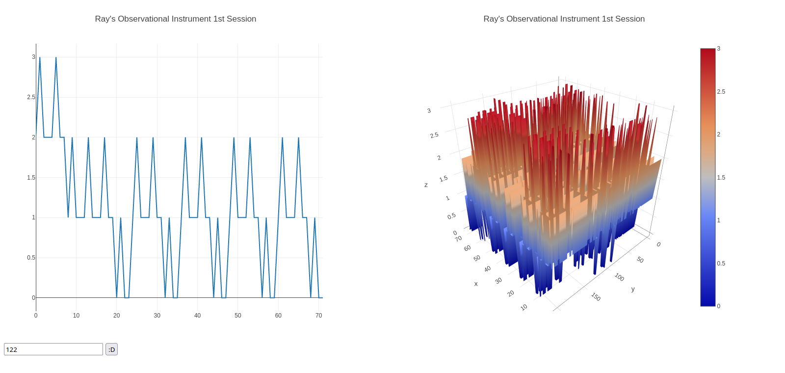

# Diario del proyecto (A partir del 2 de Octubre de 2021)

De momento el problema de la adición de mas parametros a la forma (Habilidades/Propiedad-objeto/Objetos) es irresoluble 
por lo menos hasta el sabado, pero comenzaré a graficar los datos en un mapa de calor utilizando highcharts. (9:32)

Han pasado las horas y highcharts ya fue descartado, ahora me decanté por Plotly estoy usando graficos de superficie y lineales
los primeros son para tener una ejemplificación tridimensional del entero de los datos de salida, los segundos para poder ver cada "rebanada" de la información, el critero de "rebanada" se mide en función al tiempo.

Se me ocurre... Asignar a cada caso un id numerico que sería llamado case_id esto  con el objetivo de hacer las graficas mas interpretables. (14:00)

